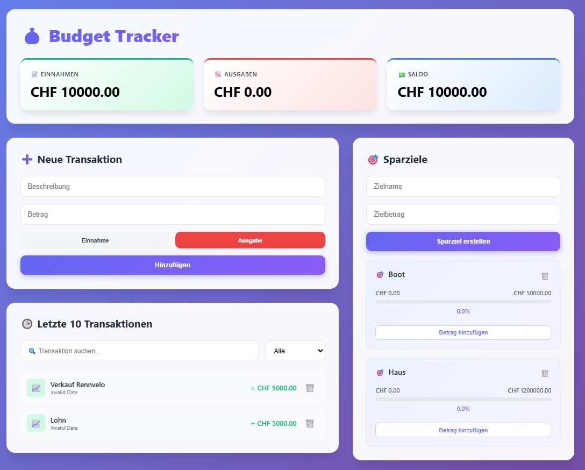
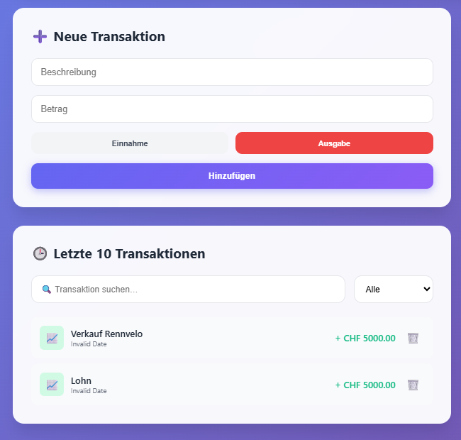
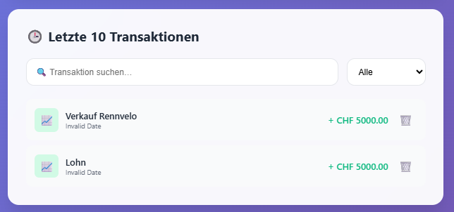

# 💰 Budget Tracker


Eine moderne Full-Stack Budget-Tracking-Applikation mit React Frontend und Node.js/Express Backend, die mit MongoDB Atlas verbunden ist.

---

## 📋 Inhaltsverzeichnis

- [Überblick](#überblick)
- [Features](#features)
- [Technologie-Stack](#technologie-stack)
- [Installation](#installation)
- [Verwendung](#verwendung)
- [API-Dokumentation](#api-dokumentation)
- [Projektstruktur](#projektstruktur)
- [Entwicklung](#entwicklung)
- [Autor](#autor)

---

## 🎯 Überblick

Der **Budget Tracker** ist eine Webanwendung zur Verwaltung persönlicher Finanzen. Die App ermöglicht das Tracken von Einnahmen und Ausgaben sowie das Setzen und Verfolgen von Sparzielen.

### Hauptfunktionen:
- ✅ Transaktionen erfassen (Einnahmen & Ausgaben)
- ✅ Sparziele erstellen und verfolgen
- ✅ Automatische Berechnung von Saldo und Summen
- ✅ Such- und Filterfunktionen
- ✅ Responsive Design mit modernem UI

**Projektzeitraum:** 10. Januar 2026 - 8. Februar 2026  
**Status:** ✅ Abgeschlossen

---

## ⭐ Features

Die Applikation implementiert **12 zentrale Features**:

### CRUD-Operationen für Transaktionen
1. **GET** - Alle Transaktionen laden und anzeigen
2. **POST** - Neue Transaktion erstellen
3. **DELETE** - Transaktion löschen

### CRUD-Operationen für Sparziele
4. **GET** - Alle Sparziele laden
5. **POST** - Neues Sparziel erstellen
6. **PATCH** - Sparziel aktualisieren (Betrag hinzufügen)
7. **DELETE** - Sparziel löschen

### Zusätzliche Features
8. **Suche** - Transaktionen durchsuchen nach Beschreibung
9. **Filter** - Transaktionen nach Typ filtern (Einnahmen/Ausgaben/Alle)
10. **Sortierung** - Sparziele alphabetisch sortiert anzeigen
11. **Berechnung** - Automatische Summenberechnung (Einnahmen, Ausgaben, Saldo)
12. **Limit** - Anzeige der letzten 10 Transaktionen

📄 **Detaillierte Feature-Dokumentation:** [features.md](features.md)

---

## 🛠️ Technologie-Stack

### Frontend
- **React** 18.x - UI-Framework
- **Axios** 1.13.2 - HTTP-Client für API-Requests
- **CSS3** - Styling mit Gradients und modernen Effekten

### Backend
- **Node.js** - JavaScript Runtime
- **Express.js** - Web Framework
- **MongoDB Atlas** - Cloud-Datenbank
- **Mongoose** - ODM für MongoDB

### Development Tools
- **Visual Studio Code** - Code-Editor
- **npm** - Package Manager
- **Git** - Versionskontrolle

📄 **Technische Details:** [technical.md](technical.md)

---

## 🚀 Installation

### Voraussetzungen
- Node.js (v16 oder höher)
- npm oder yarn
- MongoDB Atlas Account (oder lokale MongoDB-Installation)

### Backend einrichten

```bash
# 1. Repository klonen
git clone https://github.com/christophejenzer-collab/BUDGET.git
cd BUDGET

# 2. Backend-Dependencies installieren
cd backend
npm install

# 3. Umgebungsvariablen konfigurieren
# Erstelle .env Datei im backend/ Ordner:
# MONGODB_URI=deine_mongodb_connection_string
# PORT=5000

# 4. Backend starten
npm start
# Server läuft auf http://localhost:5000
```

### Frontend einrichten

```bash
# 1. Frontend-Dependencies installieren
cd ../frontend
npm install

# 2. Frontend starten
npm start
# React App läuft auf http://localhost:3000
```

📄 **Ausführliche Setup-Anleitung:** [setup.md](setup.md)

---

## 💻 Verwendung

### 1. Transaktion hinzufügen
- Beschreibung eingeben (z.B. "Gehalt", "Einkauf")
- Betrag eingeben
- Typ wählen: **Einnahme** oder **Ausgabe**
- "Hinzufügen" klicken

### 2. Sparziel erstellen
- Zielname eingeben (z.B. "Urlaub", "Auto")
- Zielbetrag festlegen
- "Sparziel erstellen" klicken

### 3. Betrag zu Sparziel hinzufügen
- Bei einem Sparziel auf "Betrag hinzufügen" klicken
- Betrag eingeben
- ✓ bestätigen

### 4. Transaktionen durchsuchen & filtern
- **Suchfeld:** Transaktionen nach Beschreibung durchsuchen
- **Filter-Dropdown:** Nur Einnahmen, Ausgaben oder Alle anzeigen

---

## 📸 Screenshots

### Dashboard-Übersicht
Die Hauptansicht zeigt Einnahmen, Ausgaben, Saldo und alle Funktionen:



### Transaktionsliste
Verwalte deine Einnahmen und Ausgaben mit Such- und Filterfunktion:



### Sparziele
Erstelle und verfolge deine Sparziele mit visuellen Fortschrittsbalken:


### Such- und Filterfunktion
Durchsuche und filtere deine Transaktionen:



---

## 📡 API-Dokumentation

### Base URL
```
http://localhost:5000/api
```

### Endpoints

#### Transactions
| Method | Endpoint | Beschreibung |
|--------|----------|--------------|
| GET | `/transactions` | Alle Transaktionen abrufen |
| POST | `/transactions` | Neue Transaktion erstellen |
| DELETE | `/transactions/:id` | Transaktion löschen |

#### Savings Goals
| Method | Endpoint | Beschreibung |
|--------|----------|--------------|
| GET | `/savings-goals` | Alle Sparziele abrufen |
| POST | `/savings-goals` | Neues Sparziel erstellen |
| PATCH | `/savings-goals/:id` | Sparziel aktualisieren |
| DELETE | `/savings-goals/:id` | Sparziel löschen |

📄 **Vollständige API-Dokumentation:** [api_documentation.md](api_documentation.md)

---

## 📁 Projektstruktur

```
BUDGET/
├── backend/
│   ├── models/
│   │   ├── SavingsGoal.js
│   │   └── Transaction.js
│   ├── routes/
│   │   ├── savingsGoals.js
│   │   └── transactions.js
│   ├── server.js
│   ├── package.json
│   └── .env
│
├── frontend/
│   ├── public/
│   │   ├── index.html
│   │   └── manifest.json
│   ├── src/
│   │   ├── components/
│   │   │   └── Dashboard.js
│   │   ├── App.js
│   │   ├── App.css
│   │   └── index.js
│   ├── package.json
│   └── README.md
│
├── README.md
├── features.md
├── api_documentation.md
├── setup.md
├── technical.md
└── journal.md
```

---

## 📝 Entwicklung

### Entwicklungszeitraum
**Start:** 10. Januar 2026  
**Abgabe:** 8. Februar 2026

### Wichtige Meilensteine
- **12.01.2026** - Backend und Frontend Setup fertig
- **17.01.2026** - Alle notwendigen Dateien erstellt, Grundstruktur aufgebaut
- **24.01.2026** - UI-Optimierung, Such- und Filterfunktion verbessert

### Was lief gut ✅
- Schnelle Umsetzung und guter Projektfortschritt
- Technisches Verständnis kontinuierlich erweitert
- Projekt-Struktur klar verstanden

### Herausforderungen 🔧
- Verschiedene KI-Tools lieferten unterschiedliche Lösungsansätze
- Code musste mehrfach umgeschrieben und optimiert werden
- Scope-Erweiterung durch neue Ideen während der Entwicklung

📄 **Vollständiges Entwicklungstagebuch:** [journal.md](journal.md)

---

## 👤 Autor

**Christophe Jenzer**  
Budget Tracker - Projektarbeit

GitHub: [@christophejenzer-collab](https://github.com/christophejenzer-collab)

---

## 📄 Lizenz

Dieses Projekt wurde im Rahmen einer Bildungseinrichtung erstellt.

---

## 🙏 Danksagung

- MongoDB Atlas für die Cloud-Datenbank
- React Community für ausgezeichnete Dokumentation
- Dozent für Feedback und Unterstützung

---

**⭐ Wenn dir dieses Projekt gefällt, gib ihm einen Star!**